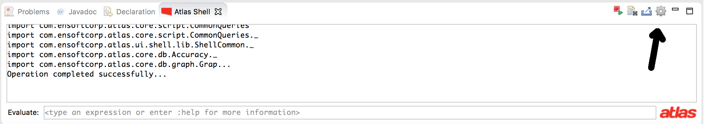
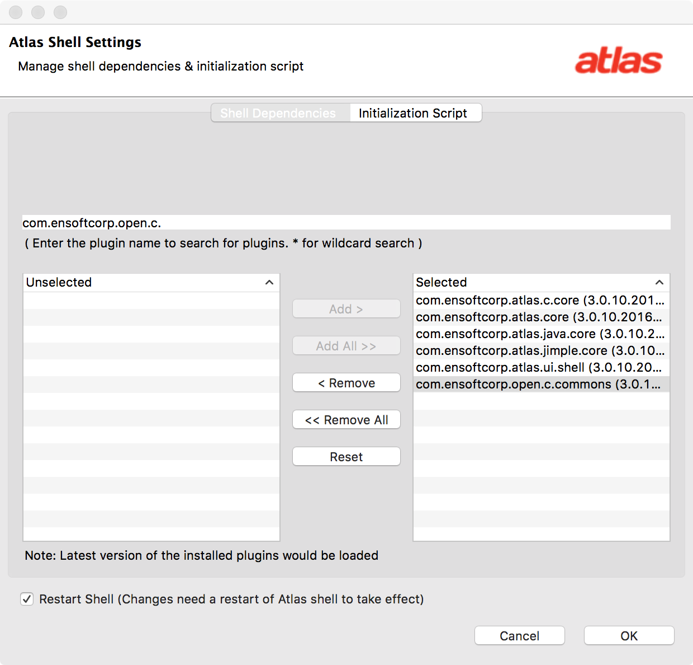
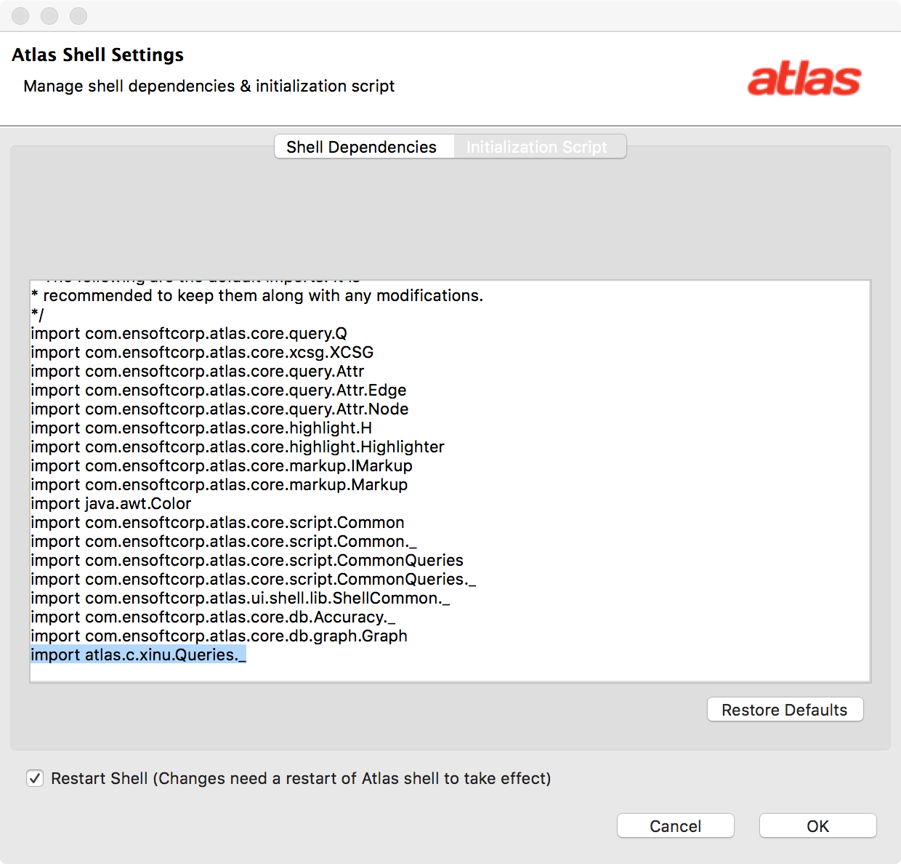

# Atlas Setup

Download a copy of Eclipse Mars for Java Developers (or the the Java EE edition). If using the Java Developers edition you will need to install the "Eclipse Plugin Development Tools" plugin. Next install Atlas by following the directions at: [http://www.ensoftcorp.com/atlas/download/]http://www.ensoftcorp.com/atlas/download/) (make sure to install all Atlas plugins including Atlas for Java and Atlas for Jimple).
Finally install the following domain specific toolboxes.

- [https://ensoftcorp.github.io/points-to-toolbox/](https://ensoftcorp.github.io/points-to-toolbox/)
- [https://ensoftcorp.github.io/call-graph-toolbox/](https://ensoftcorp.github.io/call-graph-toolbox/)
- [https://ensoftcorp.github.io/slicing-toolbox/](https://ensoftcorp.github.io/slicing-toolbox/)
- [https://ensoftcorp.github.io/c-commons-toolbox/](https://ensoftcorp.github.io/c-commons-toolbox/)

A free academic Atlas license key may be requested at: [http://www.ensoftcorp.com/atlas/](http://www.ensoftcorp.com/atlas/).

Note: To invoke code from any of the toolboxes on the Atlas Shell, first press the settings button (the gear icon) on the Atlas Shell and then add the toolbox plugin project to the classpath. You may also wish to edit the initialization script to include static imports.

For example to use the C Commons Toolbox queries do the following.

Click the gear icon on the Atlas Shell.

Add the `com.ensoftcorp.open.c.commons` plugin dependency.

Statically import the methods in the `atlas.c.xinu.Queries` class. 

Press `OK`.