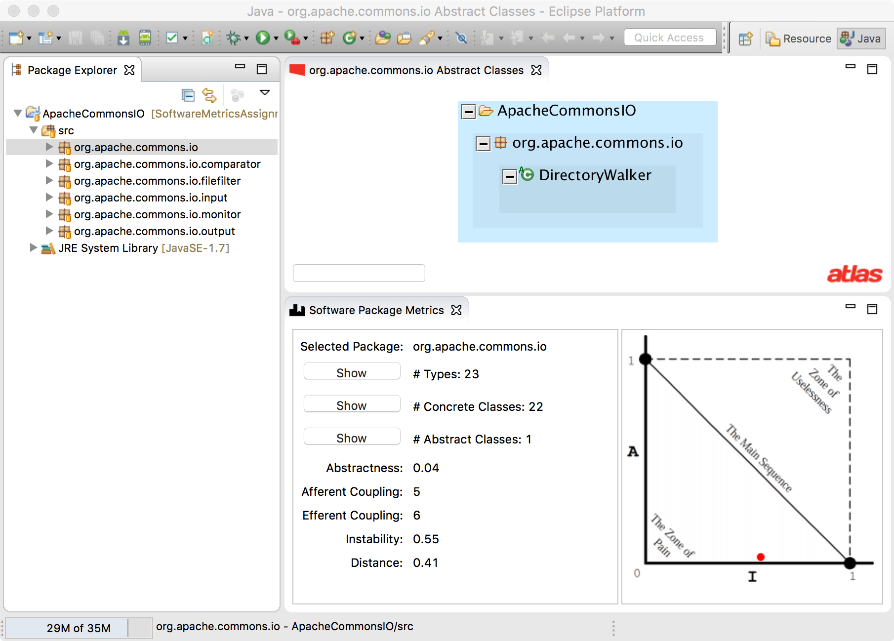

# Software Metrics Assignment
This repository contains a program analysis assignment to implement some basic software metrics. It has been assigned as a part of Iowa State University's undergraduate Software Evolution and Maintenance course. If you are an instructor wishing to use this assignment in your course please email [software-metrics@ben-holland.com](mailto:software-metrics@ben-holland.com) from your university email address for the decryption key to the example solution.

## Background

This assignment focuses on computing software package metrics.  More information on software package metrics can be found at [http://en.wikipedia.org/wiki/Software_package_metrics](http://en.wikipedia.org/wiki/Software_package_metrics).

### Abstractness
Let `Nc` be the number of classes in the package.  Let `Na` be the number of abstract classes in the package.  We metric Abstractness is defined as `A = Na/Nc`.  `A` has a range [0,1] where 0 is no abstract classes and 1 is where all classes in the package are abstract.

### Instability
There are many ways to define software dependencies, but for this homework we say a package X is dependent on package Y if a method in X calls a method in Y.

Afferent Coupling (`Ca`) is defined as the number of classes outside the package that depend upon classes inside the package.

Efferent Coupling (`Ce`) is defined as the number of classes outside the package that classes inside the package depend upon (i.e. outgoing dependencies).

The metric Instability is defined as `I = Ce/(Ca+Ce)`.  `I` has a range [0,1] where 0 is very stable and 1 is very unstable.

### Ideal Main Sequence

The ideal balance between Instability and Abstractness is along the imaginary main sequence.  You can compute the distance `D` from the ideal main sequence by computing `D=|A+I-1|`.  `D` has a range [0,1] where 0 is directly on the main sequence and 1 is the farthest away from the main sequence (towards either the zone of pain or the zone of uselessness).

## Implementation

After implementing the methods in the Metrics.java class the Software Package Metrics project can be installed as an Eclipse plugin.  The plugin adds the Software Package Metrics view (shown below) that computes package metrics for the currently selected package.

### Installation Instructions

With the Software Metrics project in the Eclipse workspace, right click on the project and select `Export`. Select `Plug-in Development`->`Deployable plug-ins and fragments`. Select the `Install into host. Repository:` radio box and click `Finish`. Press `OK` for the notice about unsigned software. Eclipse will restart and the plugin will be installed. To install again with new changes to the plugin, repeat this process.

Once you have installed the Eclipse plugin (see section below) you can open the view by navigating to `Window`->`Show View`->`Other…`->`Software Metrics`->`Software Package Metrics`. To use the view, you must have a project in the workspace and have indexed the project with [Atlas](http://www.ensoftcorp.com/atlas/). The view listens for selection events on project packages. When you select a package in an indexed application the plugin view will show you some software metrics that you have computed.